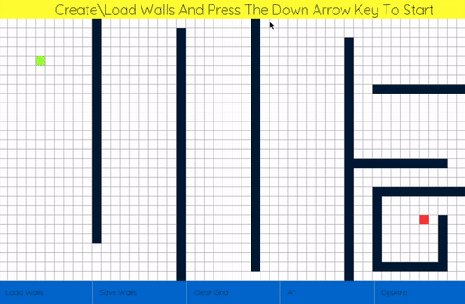
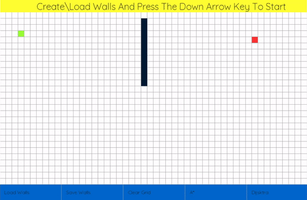

# Path Finding Visualization
This program was made in Python 3 using pygame. It gives a visualization of the A* algorithm and Dijkstra's algorithm. The user can choose a starting point and an ending point, place walls to obstruct the path, save/load a configuration of walls and choose between any two of the algorithms.

Algorithm referred from:
- [Wikipedia](https://en.wikipedia.org/wiki/A*_search_algorithm)
- [Geeksforgeeks](https://www.geeksforgeeks.org/a-search-algorithm/)
- [Nicholas Swift's medium post](https://medium.com/@nicholas.w.swift/easy-a-star-pathfinding-7e6689c7f7b2)

### A* Visualization

### Dijkstra Visualization
